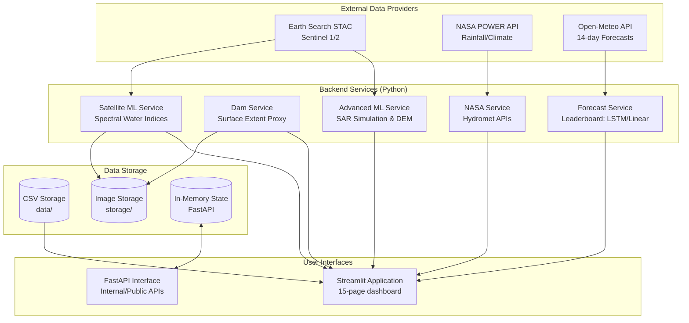

# Pakistan Flood Monitor

> Satellite-driven flood monitoring and early warning system for Pakistan's major river corridors.
> Uses **free** Earth Observation data (Sentinel-1/2, Landsat, NASA POWER/IMERG) with ML-based water detection.

## System Architecture



## Quick Start

```bash
# 1. Install the canonical API, CLI, test, and dashboard dependencies
pip install -e ".[dev,dashboard]"

# 2. Create local configuration. Do not commit this file.
cp .env.example .env
# Set APP_MODE=demo for demonstrations or APP_MODE=operational only with real providers configured.

# 3. Run the canonical API or a durable daily workflow
uvicorn pakistan_flood_monitor.api.main:app --host 0.0.0.0 --port 8000
flood-monitor run --aoi Indus-Lower

# 4. Run the dashboard
python -m streamlit run streamlit_app.py

# Dashboard available at http://localhost:8501
```

## Documentation

Detailed documentation is available in the `docs/` directory:

- [Overview](docs/overview.md) - Project goals and high-level features
- [Architecture](docs/architecture.md) - Detailed system design and data flow
- [Setup Guide](docs/setup.md) - Complete local installation instructions
- [Configuration](docs/configuration.md) - Environment variables and YAML thresholds
- [Development Workflow](docs/development.md) - Guide for extending the platform
- [API Reference](docs/api.md) - FastAPI endpoints and authentication
- [Testing Strategy](docs/testing.md) - Unit tests and historical backtesting
- [Deployment](docs/deployment.md) - Guidelines for production deployments
- [Troubleshooting](docs/troubleshooting.md) - Common errors and resolutions
- [Contributing](docs/contributing.md) - Contribution standards

## Main Features

| Feature | Description | Status |
|---|---|---|
| **Dam-Aware Risk Scoring** | Monitors upstream dams and river networks to determine downstream flood probability. | Prototype (Surface proxy) |
| **Spectral Water Indices** | Uses NDWI, MNDWI, and AWEI on Sentinel-2 to detect inundated areas. | Prototype (RGB proxy) |
| **Flood Forecasting** | Compares PyTorch LSTM against persistence and linear baselines. | Framework-ready |
| **SAR & Topography Analysis** | Uses HAND indices to validate flood simulations against terrain. | Simulation / Ready |
| **Public & Analyst Dashboards** | 15-page Streamlit application for both public warning and analyst lifecycle review. | Production-ready |
| **Historical Backtesting** | Replays historical floods (2010, 2014, 2022) to evaluate warning detection rates. | Active (Diagnostics) |

## Data Sources

All satellite imagery is **free and open**:

| Source | Auth Required | Resolution | Use |
|--------|:---:|-----------|-----|
| Sentinel-1 GRD | ❌ None | 10 m | SAR flood detection (through cloud) |
| Sentinel-2 L2A | ❌ None | 10 m | NDWI water index, visual |
| Landsat C2 L2 | ❌ None | 30 m | Long-archive optical backup |
| NASA HLS | 🔑 Free Earthdata | 30 m | Harmonized Landsat+Sentinel |
| NASA POWER | ❌ None | ~50 km | Daily rainfall, temp, humidity |
| GPM IMERG | 🔑 Free Earthdata | 11 km | 30-min global precipitation |
| Copernicus DEM | ❌ None | 30 m | Floodplain distance |

### How to get credentials (free)

1. **NASA Earthdata**: [Register](https://urs.earthdata.nasa.gov/users/new) → Get bearer token → Add to `.env.local`
2. **Earth Search STAC**: No registration needed — `https://earth-search.aws.element84.com/v1`

## Monitored Corridors

| Corridor | River | Priority | Status |
|----------|-------|:--------:|--------|
| Indus-Lower | Indus | 1 | Active |
| Indus-Upper | Indus | 2 | Active |
| Chenab-Middle | Chenab | 1 | Active |
| Jhelum-Lower | Jhelum | 3 | Active |
| Sutlej-Lower | Sutlej | 4 | Watch |
| Kabul-Nowshera | Kabul | 2 | Active |

## Project Structure

```text
pakistan-flood-monitor/
├── streamlit_app.py           # Main Streamlit entry point
├── backend_service.py         # CSV-backed data service layer
├── pages/                     # Streamlit multi-page dashboard
├── src/pakistan_flood_monitor/ # Core backend logic
│   ├── api/                   # FastAPI routes
│   └── services/              # Domain services (Dam, Forecast, ML)
├── data/                      # CSV data files
├── config/                    # YAML threshold configs
├── storage/                   # Local file storage (imagery, masks)
├── docs/                      # Technical documentation
└── tests/                     # Pytest suites and backtesting
```

## License

MIT License — See [LICENSE](LICENSE)
