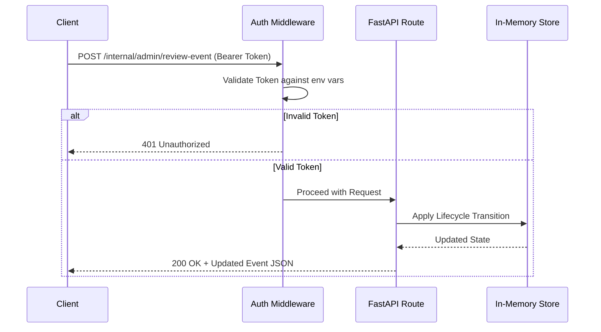

# API Contract

The project contains a programmatic REST API built with **FastAPI**. While the primary user experience is via the Streamlit dashboard (`streamlit_app.py`), the FastAPI application (`src/pakistan_flood_monitor/api/main.py`) exposes endpoints for systemic monitoring, third-party integration, and administration.

> **Note**: Currently, the FastAPI application uses an **in-memory storage model** for operational state (run history, events, review logs). Restarting the FastAPI server will reset this state.

## Starting the API

```bash
uvicorn src.pakistan_flood_monitor.api.main:app --reload --port 8000
```

## Authorization

Endpoints under `/internal` require a Bearer token in the `Authorization` header.
- For Analyst actions: Use the token specified in `FLOOD_MONITOR_ANALYST_TOKEN`.
- For Admin actions: Use the token specified in `FLOOD_MONITOR_ADMIN_TOKEN`.

Endpoints under `/public` are unauthenticated.

## Request / Response Flow



## Core Endpoints

### Public Routes (`/public`)
- `GET /public/corridors`: Returns the list of active monitored river corridors.
- `GET /public/corridors/{aoi_name}/events`: Returns active flood events for a given corridor.
- `GET /public/events/{event_id}`: Retrieves details for a specific flood event.
- `GET /public/alerts/feed`: Returns a feed of recent alerts.

### Internal Routes (`/internal`)

#### Operational Runs
- `POST /internal/run/{aoi_name}`: Manually triggers the flood monitoring pipeline for a corridor.
- `GET /internal/runs`: Lists recent pipeline execution runs.

#### Analyst Review Workflow
- `POST /internal/admin/review-event`: Advances an event through the lifecycle (`draft` -> `review` -> `approved` -> `published`).
- `POST /internal/field-reports/{report_id}/moderate`: Moderates a crowdsourced field report.

#### Settings & Configurations
- `POST /internal/admin/register-threshold`: Updates threshold weights (requires Admin).
- `GET /internal/monitoring/metrics`: Exports Prometheus-compatible operational metrics.
