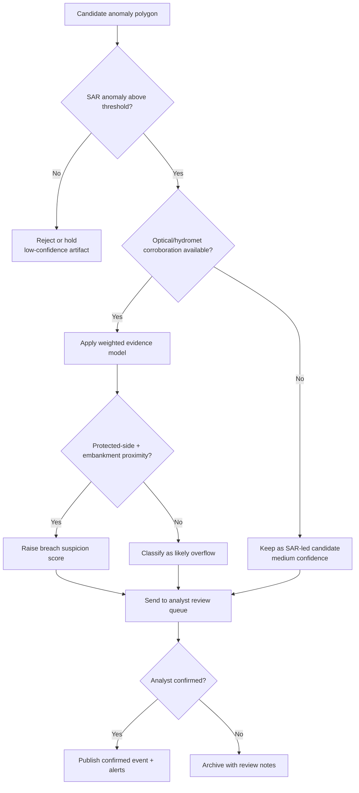

# Pakistan Flood Monitor MVP Architecture

## 1) Target MVP behavior (implemented architecture target)
The MVP is designed to:
- monitor selected river corridors daily,
- pull Sentinel-1 scenes for corridor AOIs,
- pull IMERG rainfall and GloFAS forecasts,
- compare new observations against a historical baseline,
- produce flood anomaly polygons,
- flag embankment/breach candidates,
- estimate district and asset-class exposure,
- publish map layers, event tables, alert summaries, and API outputs.

### MVP output products
1. Flood candidate map
2. Confirmed flood extent after analyst review
3. Breach suspicion layer
4. Asset exposure report
5. Alert feed with confidence score
6. Historical event dashboard

## 2) Explicitly out of scope for MVP
- Full national wall-to-wall daily processing
- Public mobile app
- Complex hydrodynamic simulation
- High-frequency social media ingestion
- Enterprise IAM / multi-tenant stack
- Expensive streaming geospatial stack
- Sophisticated deep-learning serving infrastructure
- Kubernetes before proven scale bottlenecks

## 3) Architecture layers
### Layer A — monitoring
Discovers and ingests Sentinel-1, optical support imagery, rainfall, forecast, DEM, and static masks.

### Layer B — analytics
Computes flood anomalies, breach suspicion, confidence scoring, and exposure summaries.

### Layer C — delivery
Stores reviewed events, serves APIs, powers dashboard/map layers, and emits alert-ready outputs.

### Operational decomposition in Python modules
The implementation is modular (not one large script) and organized around five responsibilities:
- fetch metadata and source data,
- preprocess raster/vector inputs,
- compute detections and confidence,
- manage review and publication state,
- expose outputs through APIs and map services.

### Supporting implementation views

### End-to-end operational flow

```mermaid
flowchart LR
    A[Daily scheduler\ncron / Prefect] --> B[Scene + hydromet discovery]
    B --> C[Ingestion + preprocessing\nSAR, optical support, masks]
    C --> D[Baseline anomaly detection]
    D --> E[Breach suspicion scoring\nweighted evidence]
    E --> F[Exposure estimation\ndistrict + assets]
    F --> G[Review queue creation]
    G --> H[Analyst review + status updates]
    H --> I[Publication + alert feed]
    I --> J[Dashboard + APIs]
```

### Decision flow for flood-event confidence

## 4) Core data model (recommended)
- `aoi_corridors`
- `river_reaches`
- `embankments`
- `satellite_scenes`
- `scene_processing_runs`
- `flood_candidates`
- `flood_events`
- `breach_candidates`
- `breach_reviews`
- `exposure_results`
- `alert_log`
- `model_versions`
- `review_queue_events`
- `validation_samples`

Design rule: separate raw observations, intermediate masks, candidate detections, reviewed detections, and published alerts.

## 5) Detection strategy
- Sentinel-1 baseline anomaly detection is the primary operational method.
- Optical support (NDWI, MNDWI, AWEI) is secondary and opportunistic.
- Multi-sensor fusion uses weighted evidence (transparent scoring) before advanced ML.

## 6) Breach logic
Classify candidates as:
- likely overflow,
- possible breach / protected-side flooding,
- uncertain anomaly.

Use weighted confidence with evidence from sensor anomaly, protected-side location, embankment proximity, growth direction, hydromet stress, terrain plausibility, persistence, and SAR/optical corroboration. Maintain probabilistic language in publications (e.g., "possible breach", "high-confidence protected-side flooding", "likely overflow").

## 7) MVP deployment preference
Prefer one strong VM or two low-cost nodes (DB/storage + worker/API). Keep operational stack simple: Python + PostGIS + FastAPI + cron/Prefect OSS + Docker.

## 8) Serving and MLOps posture
- Inference runs inside batch processing for MVP; outputs are persisted and then served by API.
- No separate real-time ML inference service is required early.
- Minimal MLOps assets include model registry metadata, snapshot versioning, config + thresholds, evaluation archive, reproducible training script, and rollback reference.
