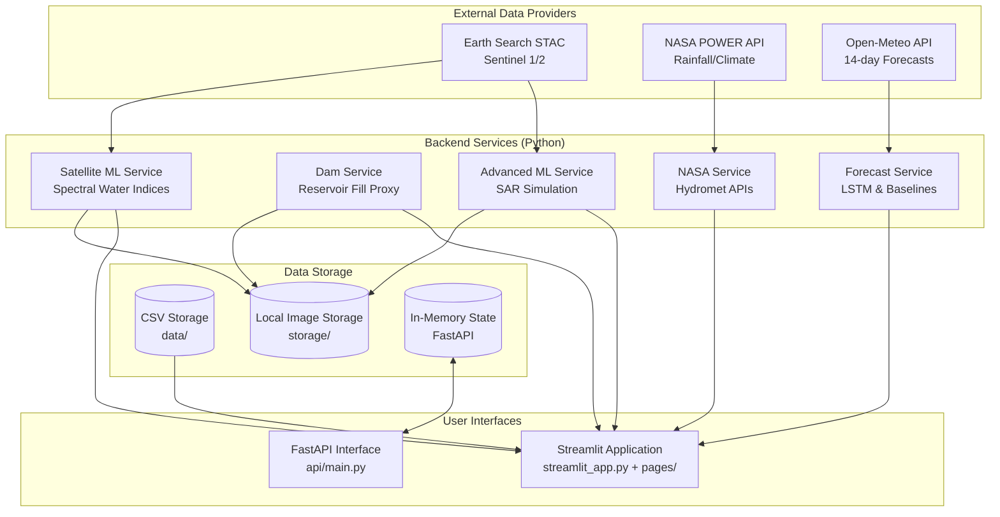
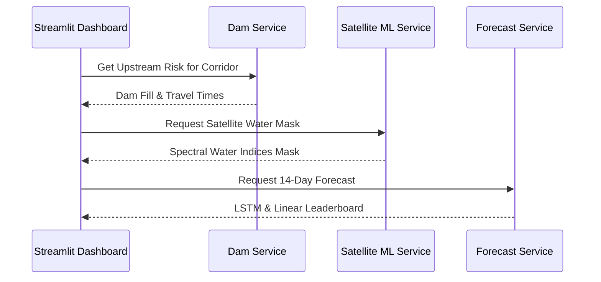

# Architecture

The Pakistan Flood Monitor is built as a hybrid Python application using **Streamlit** for the frontend dashboard, supported by several modular backend services and data pipelines.

## High-Level Architecture Diagram

## Module Interaction Flow

When an analyst reviews an area, the data flows across modules to generate a complete situational picture:

## Storage Layer

Unlike traditional enterprise stacks that require complex database setups (e.g., PostgreSQL/PostGIS), this project currently relies on a lightweight, file-based storage architecture:

1. **CSV Data (`data/`)**: Core tabular data (events, historical regions, corridors, mock data) is stored in standard CSV and JSON files. This is queried heavily by the Streamlit application via `backend_service.py`.
2. **File Storage (`storage/`)**: Downloaded satellite imagery, ML-generated water masks, and historical flood snapshots are stored directly on the local filesystem. This prevents database bloat and ensures easy ML training dataset portability.
3. **In-Memory Store**: The FastAPI module (`src/pakistan_flood_monitor/api/main.py`) stores operational state (like run history, event lifecycle, and review queues) in memory. This is primarily for runtime operations and prototype testing without database overhead.

> **Note**: A known limitation of the current architecture is the "split-brain" syndrome. Streamlit queries services and storage directly, bypassing the FastAPI application. Future iterations will route Streamlit requests through FastAPI using `httpx`.

## Core Modules

- `satellite_ml_service.py`: Discovers images via STAC and runs Spectral Index processing (NDWI/MNDWI/AWEI) to distinguish water from land.
- `dam_service.py`: Computes haversine distances to map river flow, fetches bounding box imagery, and scores flood risk based on upstream dam surface area fills.
- `advanced_ml_service.py`: A simulated module to evaluate SAR (Synthetic Aperture Radar) inputs which penetrate clouds, and real topography logic using Copernicus DEM/HAND metrics.
- `forecast_service.py`: Integrates with external weather APIs to provide look-ahead river level predictions via a model leaderboard (Persistence vs Linear vs LSTM).
- `backend_service.py`: Provides read interfaces for Streamlit to parse the `data/` directory CSV files seamlessly.
