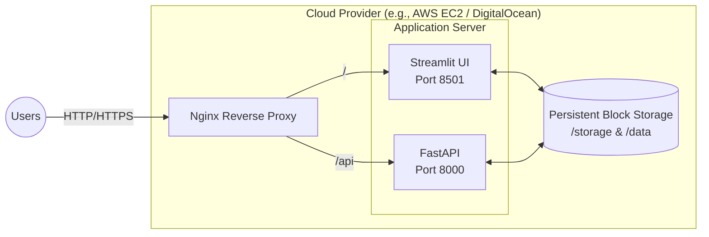

# Deployment Guide

The Pakistan Flood Monitor is currently designed as a prototype to be run locally or on a single virtual machine. It consists of two primary services: the Streamlit Dashboard and the FastAPI backend.

## Deployment Architecture



## Considerations for Production

Currently, the system is **not production-ready** for high availability due to the following architectural constraints:

1. **In-Memory State**: The FastAPI application stores runtime state in memory. Any restart or crash will lose the operational queue.
2. **File-Based Storage**: The Streamlit application relies on local CSVs and image folders. While this works on a single VM, it cannot scale horizontally across multiple instances without a shared network drive or migration to cloud object storage (e.g., AWS S3).
3. **Split-Brain Syndrome**: Streamlit queries local data services directly rather than pulling everything exclusively through the FastAPI backend.

## Single VM Deployment Steps

To deploy the current prototype to a single cloud VM (e.g., Ubuntu 22.04):

1. **Clone the repository**:
   ```bash
   git clone https://github.com/afaq-ahmad/pakistan-flood-monitor.git
   cd pakistan-flood-monitor
   ```

2. **Setup Environment**:
   ```bash
   python3 -m venv .venv
   source .venv/bin/activate
   pip install -e ".[dev]"
   cp .env.local.example .env.prod
   # Add your NASA Earthdata credentials and other secrets to .env.prod
   ```

3. **Run via Process Manager (e.g., PM2 or Systemd)**:
   It is recommended to run both services using a process manager to ensure they restart on failure.

   *FastAPI*:
   ```bash
   uvicorn src.pakistan_flood_monitor.api.main:app --host 0.0.0.0 --port 8000
   ```

   *Streamlit*:
   ```bash
   python -m streamlit run streamlit_app.py --server.port 8501 --server.address 0.0.0.0
   ```

4. **Nginx Configuration**:
   Configure Nginx to proxy pass `/` to `localhost:8501` and `/api` to `localhost:8000`.

## Future Deployment Roadmap

Before scaling for true multi-user institutional deployment, the following must be implemented:
- **Database Layer**: Migrate in-memory state and CSV data to PostgreSQL/PostGIS.
- **Object Storage**: Move `storage/` contents to an S3-compatible object store.
- **Background Workers**: Move long-running satellite ML downloads from synchronous execution to Celery/Redis workers.
