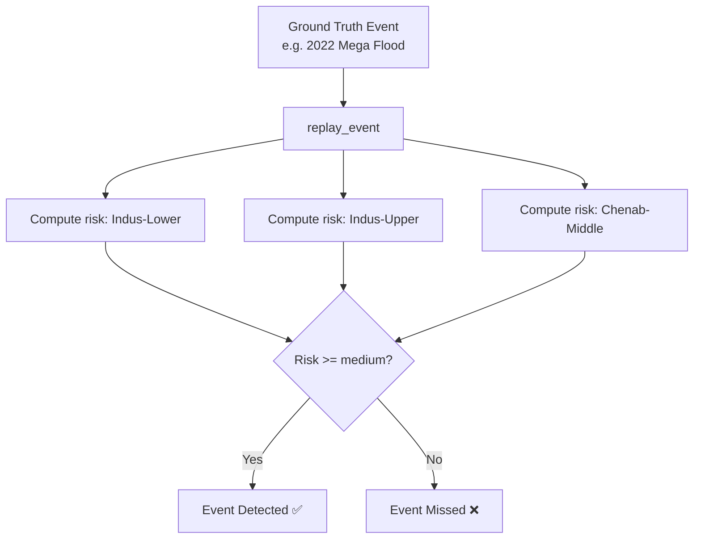

# Testing Strategy

The Pakistan Flood Monitor employs a testing strategy centered around `pytest`. Because the system relies heavily on external satellite APIs and ML inferences, testing is divided into structural unit tests, data integrity tests, and historical backtesting.

## Running Tests

To run the entire test suite:
```bash
python -m pytest tests/ -v
```

## Historical Backtesting Framework

The most critical test of the flood monitor is its ability to detect real, historical catastrophes. We have implemented a backtesting framework (`tests/test_backtesting.py`) that replays major historical events (e.g., the 2010 and 2022 Mega Floods) through the current risk model.



**Current Gap**: The backtest currently documents a gap in detection (0/3 detection rate) due to the system relying on conservative heuristic fallbacks when satellite imagery is not actively fetched. This is expected behavior for the prototype, and the test serves as a diagnostic target for future calibration.

## Unit Testing

Unit tests focus heavily on:
1. **Dam Database Integrity**: Ensuring all hardcoded dams have correct metadata, IDs, and upstream mapping.
2. **Haversine Math**: Verifying geographic distance calculations between coordinates.
3. **Risk Scoring Logic**: Validating that various fill-level classifications generate the correct upstream risk scores.
4. **Edge Cases**: Ensuring missing imagery or boundary conditions don't crash the risk pipelines.

## Test Directory Structure

```text
tests/
├── test_dam_service.py      # Validates dam mappings, graph edges, and risk math
├── test_backtesting.py      # Replays historical events against the risk model
└── ...
```

## Writing New Tests

1. Create a file prefixed with `test_` in the `tests/` directory.
2. Use `pytest` fixtures for mocking external API calls (e.g., STAC or Open-Meteo).
3. Do not run live network calls in standard unit tests. Mock the responses to ensure tests remain fast and deterministic.
4. If writing a new backtest event, add the ground truth data to `GROUND_TRUTH_EVENTS` in `test_backtesting.py`.
